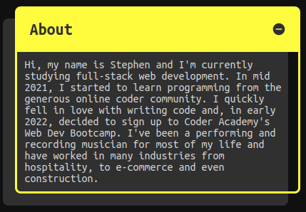

# <a id="top"></a> S.J. Smith Portfolio

Website: https://smith-sj.github.io/portfolio/

Github: https://github.com/smith-sj/portfolio

## Table of Contents

- [Purpose](#purpose)
- [Target Audience](#target-audience)
- [Tech Stack](#tech-stack)
- [Functionality & Features](#functionality)
- [Sitemap](#sitemap)
- [Screenshots](#screenshots)
    - [Mobile](#mobile)
    - [Desktop](#desktop)


---

## <a id="purpose"></a> Purpose

[[back to top]](#top)

The purpose of the project is to demonstrate my programming skills and experience to recruiters and potential employers. It is also an opportunity to show my personality and provide some insight into my creative process and personal aesthetic. Finally, it is an archive of articles for anyone who may be interested in web dev discussion, tutorials, and general news.

---

## <a id="target-audience"></a> Target Audience

[[back to top]](#top)

- Recruiters
- Employers
- Web dev enthusiasts

---

## <a id="tech-stack"></a> Tech Stack
[[back to top]](#top)
- HTML
- CSS
- JavaScript

Deployed on Github Pages

---

## <a id="functionality"></a> Functionality & Features

[[back to top]](#top)

The two main objectives I kept in mind while designing the functionality of my website were:

1. **Create a responsive, mobile first website**
1. **Use accessible and inuitive design**

### Creating a responsive, mobile first website:

This objective focused on designing the website from a **mobile user's perspective**, before making adjustments to suit tablet and desktop users. *Mobile first* isn't just about viewports and layouts, but also involves consideration of the overall site map and functionality of each component. One of the first major decisions I made in this particular area, was to try and fit my important content on a single, well-organised and scrollable page. I had already decided that my website would take a minimal approach to content, as I wanted the reader to quickly and easily understand my skills, interests and personality, without being overwhelmed with information.


My solution to fitting all of this content on the homepage was to build these accordian-like content boxes. To build them, I used the HTML `<details>` and  `<summary>` tags. These tags can be used in many ways, and are a great way to maximize page space. 

To use them, simply enter a title or some summarised text in the `<summary></summary>` tags, and put whatever content you want below. Then just wrap the summary and content in the `<details></details>` tags.

```
<details>
    <summary>
        <h2>Heading</h2>
    </summary>
    <p>
    Content for accordian
    </p>
</details>
```

I wasn't sure what the documentation would say about putting `<h2>` tags inside the `<summary>` element but, thankfully, **[MDN Web Docs](https://developer.mozilla.org/en-US/docs/Web/HTML/Element/summary)** states that permitted content includes *"Phrasing content or one element of Heading content."*

These collapsable content boxes allowed me to put the majority of my content on the homepage so the mobile user didn't have to keep scrolling back to a navbar to move around pages. Most of the information a recruiter would be looking for can be quickly expanded and collapsed without having to scroll at all.

 

In terms of responsivity; thanks to the simple nature of my portfolio's design, I only needed to make some small adjustments for desktop and tablet. One was to give the main content wrapper a max-width, so it would stop expanding at a specific point. The other was to add some media queries for desktop and for the Samsung Galaxy Fold. The desktop media query, simply brought the main heading and theme-switch closer to the center of the screen *(testing on an ultrawide monitor revealed that it was quite awkard having the navbar spread out across the entire monitor.)* As for the Samsung Galaxy Fold, when it is in folded position the navbar turned into a bit of a mess, so I switched it to a flex column instead and adjusted the spacing. 

 


### Using accessible and inuitive design methods:

My biggest focus in this area was making sure to use semantic HTML, as well as making sure that all switches, filters and links were accessible via the tab, space and enter key. I also tested my portfolio's colors across diferrent visual impairments. As I used the checkbox hack to build the theme-switch and blog category filters, I had to make sure to not just hide the checkbox, but rather shape it to the labels and make them transparent instead of setting them to `hidden`. This meant that although you can't see them, tabbing to the checkboxes creates an outline around the switch and filters, and allows them to be toggles or activated.

Mozilla Firefox's accessibility tools made it easy for me to see how my portfolio looked for people with different vision impairments, including Protanapia, Deuteranopia, Tritanopia and Achromatopsia; It also has a handy tool that displays your tab index order, which made it easy to check every page was tabbed correctly. I adjusted the contrast of my colors so that they would be suitable for people with low contrast, but also not too contrasted that it was difficult to read for people with no vision impairments. I also changed the areas which were highlighted when the theme was switched to dark mode, as bright yellow seems a lot brighter when the rest of the theme is dark.

 

---

## <a id="sitemap"></a> Sitemap
[[back to top]](#top)

The sitemap for my portfolio is farily straight forward; considering most of the content is contained on the homepage, the only other page required was a blog archive. A post navigator is included at the bottom of each blog post, in case the reader is enjoying my content and would like to keep reading; this makes for a smooth transition between blog posts, with no extra steps.

I also included a **Recent Posts** section on the homepage, which acts as another entry point into the blog post loop. The home page also has a link to my resume download and external links to my professional social media accounts.

 

---

## <a id="screenshots"></a> Screenshots

<a id="mobile"></a>

[[back to top]](#top)

### Mobile Screenshots


<a id="desktop"></a>

### Desktop Screenshots

[[back to top]](#top)


---